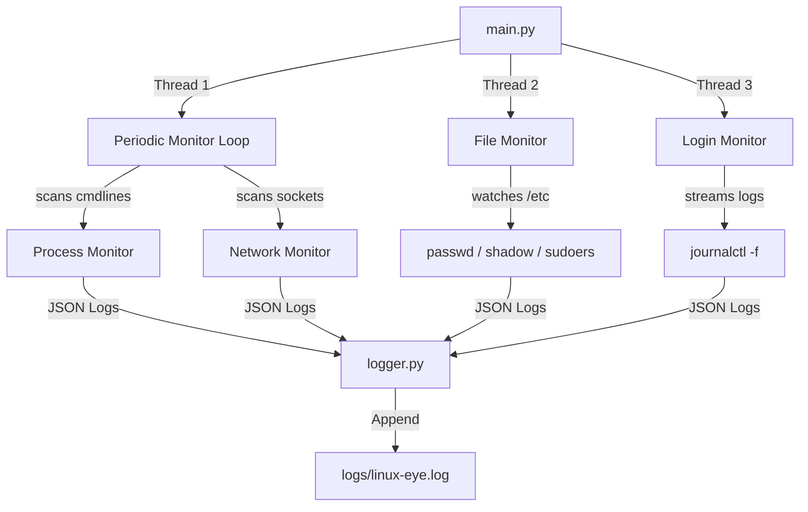

# 👁️ LinuxEye

[](LICENSE)
[](https://www.python.org/)
[](#)

LinuxEye is a lightweight, real-time security monitor (Endpoint Detection and Response - EDR style) designed for Linux environments. It runs silently in the background, monitoring system activity across processes, network sockets, critical configuration files, and authentication logs to detect suspicious behavior and potential security threats.

---

## 🔍 Key Detection Engines

### 1. ⚙️ Process Activity Monitor
Scans running system processes using `psutil` to inspect active commands, flags, and executable paths.
* **Suspicious Commands**: Identifies reverse shells (e.g., `bash -i`, `nc -e`), download-and-execute strings (`curl | sh`), inline scripting execution (`python -c`, `perl -e`), persistence mechanics (`systemctl enable`), base64 obfuscation, and high-impact operations (`rm -rf`, `chmod 777`).
* **Hacking Tools**: Searches process lists for signature executable names like `nmap`, `netcat`, `sqlmap`, `msfconsole`, and `bettercap`.

### 2. 🌐 Network Socket Monitor
Tracks active socket connections and maps external IP addresses to port usage.
* **Port Scan Detection**: Raises a `CRITICAL` alert if a remote host attempts to communicate with more than **2 distinct ports** within a rolling **3-second window**.

### 3. 📂 Filesystem Monitor
Uses Linux kernel `inotify` events via `inotify_simple` to hook directly into `/etc` directory updates.
* **Target Files**: Actively monitors `/etc/passwd`, `/etc/shadow`, and `/etc/sudoers`.
* **Events**: Logs a `CRITICAL` alert for direct file modifications or deletions, and a `WARNING` for permission or attribute overrides (`flags.ATTRIB`).

### 4. 🔐 Authentication & Login Monitor
Spawns an asynchronous log-stream reader reading directly from `journalctl -f`.
* **Event Scanners**: Detects successful `sudo` session starts (`INFO`) and wrong password attempts (`WARNING`).
* **Brute-Force Detection**: Implements a sliding window queue. If login failures for a specific username cross the configured threshold (e.g., 3 failures within 60 seconds), it raises a `CRITICAL` brute-force alarm.

---

## 🏗️ Architecture



---

## 🛠️ Project Structure

```text
linux-eye/
├── config/
│   └── config.yaml             # YAML Configuration file
├── linux_eye/
│   ├── __init__.py
│   ├── main.py                 # Multi-threaded runner entry point
│   ├── monitors/
│   │   ├── __init__.py
│   │   ├── file_monitor.py     # Filesystem inotify event handler
│   │   ├── login_monitor.py    # Log/journal stream & brute-force engine
│   │   ├── network_monitor.py  # Socket connections port-scanner detector
│   │   └── process_monitor.py  # Signature/heuristics process scanner
│   └── utils/
│       ├── __init__.py
│       ├── config.py           # Configuration parser
│       └── logger.py           # Structured JSON Lines log-writer
├── logs/
│   └── linux-eye.log           # Generated structured audit logs (JSONL)
├── LICENSE
├── README.md
├── idea.txt
└── requirements.txt
```

---

## 🚀 Installation & Setup

### Prerequisites
* Linux OS with systemd/journalctl and `/proc` interface accessibility.
* Python **3.10** or newer.
* Root or `sudo` privilege (required to hook filesystem events in `/etc`, inspect raw network sockets, and stream system journal auth logs).

### Instructions

1. **Clone the repository:**
   ```bash
   git clone https://github.com/amitpadhan525/linux-eye.git
   cd linux-eye
   ```

2. **Set up a Virtual Environment & Install Dependencies:**
   ```bash
   python3 -m venv .venv
   source .venv/bin/activate
   pip install -r requirements.txt
   ```

---

## ⚙️ Configuration

Settings are parsed from [config/config.yaml](config/config.yaml):

```yaml
general:
  tool_name: LinuxEye
  log_dir: logs/
  log_file: linux-eye.log
  refresh_interval: 5        # Refresh time (seconds) for processes/network loops

login_monitor:
  window_seconds: 60         # Rolling window (seconds) for brute force check
  threshold: 3               # Limit of login failures before generating alert
```

---

## 💻 Usage

Always launch LinuxEye with administrative privileges to ensure all detection mechanisms have access to target telemetry:

```bash
sudo .venv/bin/python -m linux_eye.main
```

Upon starting, you will see:
```text
------- LinuxEye Started -------
RUNNING
```

---

## 📝 Structured Audit Logs

All events are formatted as single-line JSON entries (JSONL) written to the path specified in the config (`logs/linux-eye.log`).

### Log Levels
* `INFO` - Standard system behaviors (e.g., successful user logins).
* `WARNING` - Unusual or potentially unsanctioned behavior (e.g., file permissions changed, incorrect password attempts).
* `CRITICAL` - Malicious process commands, active port scans, deletions of critical files, or SSH brute-force alarms.

### Sample Entries
```json
{"timestamp": "2026-07-16T10:15:30.123456", "severity": "INFO", "message": "Login sucessfull", "source": "Log monitor", "details": "pam_unix(sudo:session): session opened for user root"}
{"timestamp": "2026-07-16T10:16:02.789012", "severity": "WARNING", "message": "Critical system file permission changed", "source": "Files_monitor", "details": {"filename": "passwd", "path": "/etc/passwd", "event_type": "Permission Changed"}}
{"timestamp": "2026-07-16T10:16:45.456789", "severity": "CRITICAL", "message": "Multiple failed login attempt on user admin.", "source": "Log monitor", "details": {"username": "admin", "failure_count": 3, "window_seconds": 60}}
{"timestamp": "2026-07-16T10:17:10.987654", "severity": "CRITICAL", "message": "Possible port scan detected", "source": "network_monitor", "details": "192.168.1.102 hit {22, 80, 443} multiple ports recently"}
{"timestamp": "2026-07-16T10:18:05.112233", "severity": "CRITICAL", "message": "Suspicious command detected: nc -lvnp 4444", "source": "process_monitor", "details": {"pid": 25482, "name": "nc", "username": "attacker", "cmdline": ["nc", "-lvnp", "4444"], "exe": "/usr/bin/nc"}}
```

---

## ⚠️ Notes & Limitations
* **User Permissions**: Without `sudo` access, the process/network scanners will experience permissions issues querying files under `/proc`, inotify will fail to watch `/etc/shadow`, and the login monitor will be unable to read journalctl streams.
* **Process Signatures**: Detection is heuristic and checks command lines and tool names. Extremely advanced or obfuscated binaries might slip past standard text queries.
* **Resource Optimization**: Adjust the `refresh_interval` in `config/config.yaml` to balance between monitoring speed and cpu/memory overhead.
